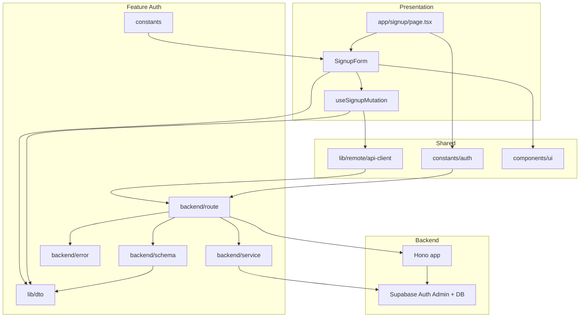
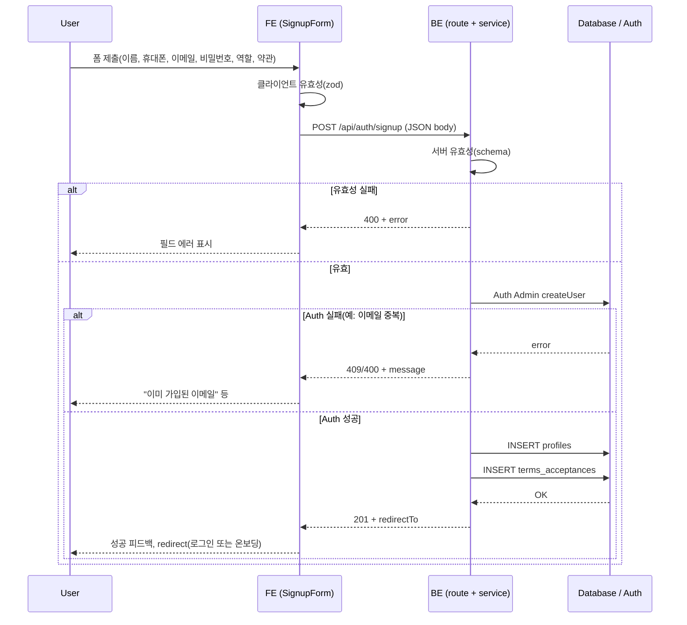

# 001. 회원가입 & 역할선택 — 모듈 설계 및 구현 계획

spec.md 유스케이스 구현을 위한 최소 모듈화 설계. AGENTS.md 구조 및 컨벤션 준수.

---

## 1. 요구사항 정리 (유스케이스 기반)

| 구분 | 내용 |
|------|------|
| **입력** | 이름, 휴대폰번호, 이메일, 비밀번호, 약관동의(필수 약관 유형 목록), 역할(광고주/인플루언서), 인증방식(최소 1차: 이메일/비밀번호) |
| **처리** | 클라이언트·서버 유효성 검사 → Auth 계정 생성(Supabase) → profiles 1건 생성 → terms_acceptances 이력 저장 → 성공 시 역할별 redirectTo 반환 |
| **출력** | 성공 시 201 + redirectTo(로그인 또는 역할별 온보딩 경로), 실패 시 400/409/500 + error code/message |
| **에지** | 필수·형식 오류, 이메일 중복, 약관 미동의, 레이트 리밋, Auth/DB 실패 시 명시적 에러 메시지 |
| **비즈니스 규칙** | 역할 1개만 선택, 필수 약관 동의 필수, 이메일 유일, Auth 생성 후 반드시 profile + terms_acceptances 저장 |

---

## 2. 코드베이스 반영 사항

- **기존 signup**: `app/signup/page.tsx`는 이메일·비밀번호만 사용, 프로필/역할/약관 없음. BE API 없음.
- **Feature 구조**: `src/features/[featureName]/backend`(route, service, schema, error), `hooks`, `components`, `lib/dto`.
- **HTTP**: 훅은 `@/lib/remote/api-client` 경유, Hono 라우트는 `/api` prefix 필수.
- **응답**: `success`/`failure`/`respond` 패턴, HandlerResult 타입.
- **폼**: shadcn `Form` + react-hook-form + zod resolver 사용 가능.
- **Auth**: Supabase; BE는 service-role로 DB·Auth Admin 사용. FE는 browser client로 signUp/getUser.

---

## 3. 개요 — 모듈 목록

| 모듈 | 위치 | 설명 |
|------|------|------|
| **Auth 경로 상수** | `src/constants/auth.ts` | 회원가입 후 이동 경로(로그인, 광고주/인플루언서 온보딩) 추가. |
| **Signup 스키마** | `src/features/auth/backend/schema.ts` | 회원가입 요청/응답 Zod 스키마(이름, 휴대폰, 이메일, 비밀번호, 역할, 약관). |
| **Signup 에러 코드** | `src/features/auth/backend/error.ts` | 회원가입 전용 에러 코드 상수 및 타입. |
| **Signup 서비스** | `src/features/auth/backend/service.ts` | Auth 계정 생성 + profiles/terms_acceptances 저장(트랜잭션/순차 처리). |
| **Signup 라우트** | `src/features/auth/backend/route.ts` | POST /api/auth/signup 파싱·검증·서비스 호출·응답. |
| **Auth 라우트 등록** | `src/backend/hono/app.ts` | registerAuthRoutes(app) 호출로 signup 라우트 등록. |
| **Signup DTO (FE)** | `src/features/auth/lib/dto.ts` | 스키마 재노출(요청/응답 타입, resolver용). |
| **useSignupMutation** | `src/features/auth/hooks/useSignupMutation.ts` | useMutation, apiClient.post('/api/auth/signup'), 성공 시 redirect/토스트. |
| **SignupForm** | `src/features/auth/components/SignupForm.tsx` | 회원가입 폼 UI(이름, 휴대폰, 이메일, 비밀번호, 역할, 약관), react-hook-form + zod. |
| **Signup 페이지** | `src/app/signup/page.tsx` | 비로그인 전제, SignupForm 사용, 이미 로그인 시 리다이렉트. |

**공통/공유**
- `api-client`, `Form`/`Input`/`Button`/`Checkbox` 등 기존 UI·lib 그대로 사용.
- 역할·필수 약관 유형은 `src/features/auth/constants` 또는 `src/constants`에 상수로 두어 공유.

---

## 4. Diagram — 모듈 관계

---

## 5. Implementation Plan

### 5.1 constants/auth.ts

- **목표**: 회원가입 후 이동 경로를 한 곳에서 관리.
- **작업**: `ADVERTISER_ONBOARDING_PATH`, `INFLUENCER_ONBOARDING_PATH` 상수 추가. 필요 시 `getSignupRedirectForRole(role: AppRole): string` 유틸(로그인 페이지 + next 쿼리 또는 온보딩 경로 반환).
- **의존**: 없음.

---

### 5.2 features/auth/backend/error.ts

- **목표**: 회원가입 실패 시 일관된 에러 코드.
- **작업**: 신규 파일 또는 기존 auth 관련 error 통합. `authErrorCodes`: `EMAIL_ALREADY_EXISTS`, `VALIDATION_ERROR`, `PROFILE_CREATE_FAILED`, `TERMS_SAVE_FAILED`, `AUTH_CREATE_FAILED` 등 정의. `AuthServiceError` 타입 export.
- **테스트**: 단위 테스트 없음(상수만). 필요 시 에러 코드 매핑 테스트.

---

### 5.3 features/auth/backend/schema.ts

- **목표**: 회원가입 요청/응답 스키마(zod), BE·FE 공통.
- **작업**:
  - `AppRoleSchema = z.enum(['advertiser','influencer'])`.
  - `SignupRequestSchema`: name(string, min 1), phone(string, 패턴 또는 min), email(email), password(min 6 등), role(AppRoleSchema), acceptedTermsTypes(z.array(z.string()).min(1)).
  - `SignupResponseSchema`: redirectTo(z.string()), role(optional).
  - 타입 export: `SignupRequest`, `SignupResponse`.
- **Unit test**: 스키마만 단위 테스트.
  - 유효한 payload 통과.
  - role 잘못된 값, acceptedTermsTypes 빈 배열, email 형식 오류, password 짧음 → 실패.

---

### 5.4 features/auth/backend/service.ts

- **목표**: Auth 유저 생성 후 profiles·terms_acceptances 저장.
- **작업**:
  - `createAccountWithProfile(client, body: SignupRequest): Promise<HandlerResult<SignupResponse, AuthServiceError>>`.
  - 순서: 1) `client.auth.admin.createUser({ email, password, email_confirm: true })`(또는 프로젝트 정책에 맞게). 2) auth_user_id로 `profiles` INSERT (name, phone, email, role). 3) 해당 profile_id로 `terms_acceptances` bulk INSERT (terms_type from acceptedTermsTypes). 4) `getSignupRedirectForRole(role)`로 redirectTo 생성해 success 반환.
  - Auth 실패(이메일 중복 등) → failure 409/400. DB 실패 → failure 500, 해당 코드.
- **Unit test**:
  - Mock Supabase: createUser 성공 시 profile·terms insert 호출 여부, 반환 redirectTo 검증.
  - createUser 실패(이메일 중복) 시 failure 코드 및 메시지.
  - profile insert 실패 시 적절한 에러 반환(트랜잭션 없으면 orphan auth user 가능성 있음 — 최소 스펙에서는 로그로 처리 또는 나중에 트랜잭션/보상 추가).

---

### 5.5 features/auth/backend/route.ts

- **목표**: POST /api/auth/signup 수신 및 서비스 연동.
- **작업**:
  - 신규 파일 또는 기존 auth 라우트 파일에 `registerAuthRoutes(app)` 구현.
  - `app.post('/api/auth/signup', async (c) => { body = SignupRequestSchema.safeParse(await c.req.json()); ... getSupabase(c); result = await createAccountWithProfile(supabase, body.data); return respond(c, result); })`.
  - 레이트 리밋: 최소 스펙에서는 생략 가능. 명시 시 미들웨어 또는 route 내 단순 카운트(메모리/Redis)로 제한.
- **의존**: schema, service, error, response, context.

---

### 5.6 backend/hono/app.ts

- **목표**: Auth 라우트 노출.
- **작업**: `registerAuthRoutes(app)` import 후 `registerExampleRoutes(app)` 다음에 호출.
- **의존**: features/auth/backend/route.

---

### 5.7 features/auth/lib/dto.ts

- **목표**: FE에서 스키마·타입 재사용.
- **작업**: SignupRequestSchema, SignupResponseSchema, SignupRequest, SignupResponse, AppRoleSchema 등 backend/schema에서 re-export. (기존 auth types와 충돌 없도록 네이밍 유지.)
- **의존**: backend/schema.

---

### 5.8 features/auth/constants (또는 constants/auth.ts 확장)

- **목표**: 필수 약관 유형, 역할 라벨 등 FE·BE 공통.
- **작업**: `REQUIRED_TERMS_TYPES = ['service','privacy'] as const`, `APP_ROLE_LABELS` 등. BE schema에서 terms 검증 시 이 목록 참조 가능.
- **의존**: 없음.

---

### 5.9 features/auth/hooks/useSignupMutation.ts

- **목표**: 회원가입 API 호출 및 성공 시 이동·에러 처리.
- **작업**: `useMutation`(mutationFn: apiClient.post('/api/auth/signup', data)), onSuccess에서 `redirectTo`로 router.replace 또는 toast 후 로그인 페이지로. onError에서 `extractApiErrorMessage`로 메시지 표시(토스트 또는 form setError).
- **의존**: api-client, dto, constants/auth(redirect 보조).

---

### 5.10 features/auth/components/SignupForm.tsx (Presentation)

- **목표**: 회원가입 폼 UI 및 클라이언트 검증.
- **작업**:
  - `use client`. react-hook-form + zodResolver(SignupRequestSchema). 필드: 이름, 휴대폰, 이메일, 비밀번호, 비밀번호 확인, 역할(라디오/셀렉트), 필수 약관 체크박스(REQUIRED_TERMS_TYPES 매핑). 제출 시 useSignupMutation.mutate(values). 필드별 에러는 FormField/FormMessage로 표시.
  - AGENTS: Client Component, shadcn Form/Input/Button/Checkbox 사용.
- **QA Sheet (Presentation)**:
  - [ ] 비로그인 상태에서만 폼 노출(로그인 시 리다이렉트).
  - [ ] 필수값 누락 시 제출 비활성화 또는 필드 에러 표시.
  - [ ] 이메일 형식 오류 시 에러 메시지 표시.
  - [ ] 비밀번호·비밀번호 확인 불일치 시 에러 표시.
  - [ ] 필수 약관 미체크 시 제출 불가 또는 동의 요청 메시지.
  - [ ] 역할 선택(광고주/인플루언서) 한 개만 선택 가능.
  - [ ] 제출 성공 시 성공 메시지 및 redirect(로그인 또는 안내 문구 후 로그인 페이지).
  - [ ] 이메일 중복 시 "이미 가입된 이메일" 등 서버 에러 메시지 표시.
  - [ ] 네트워크/서버 오류 시 사용자에게 안내 메시지 표시.
  - [ ] 반응형·접근성(라벨, 포커스, 키보드 이동) 확인.

---

### 5.11 app/signup/page.tsx

- **목표**: 회원가입 진입점.
- **작업**: 기존 페이지 수정. useCurrentUser로 이미 로그인 시 redirect(redirectedFrom 또는 '/'). 그 외 레이아웃 내 `<SignupForm />` 렌더. params는 Promise로 받아 void 처리(AGENTS).
- **QA Sheet**: 위 SignupForm QA와 동일 페이지에서 수행.

---

## 6. 구현 순서 권장

1. constants/auth 확장 + features/auth/constants(필수 약관 유형).
2. backend: error → schema → service → route.
3. backend/hono/app.ts에 registerAuthRoutes 등록.
4. features/auth/lib/dto.ts.
5. useSignupMutation 훅.
6. SignupForm 컴포넌트.
7. app/signup/page.tsx 연동.
8. 단위 테스트(schema, service) 및 QA 시트 실행.

---

*참조: docs/001/spec.md, .ruler/AGENTS.md*
