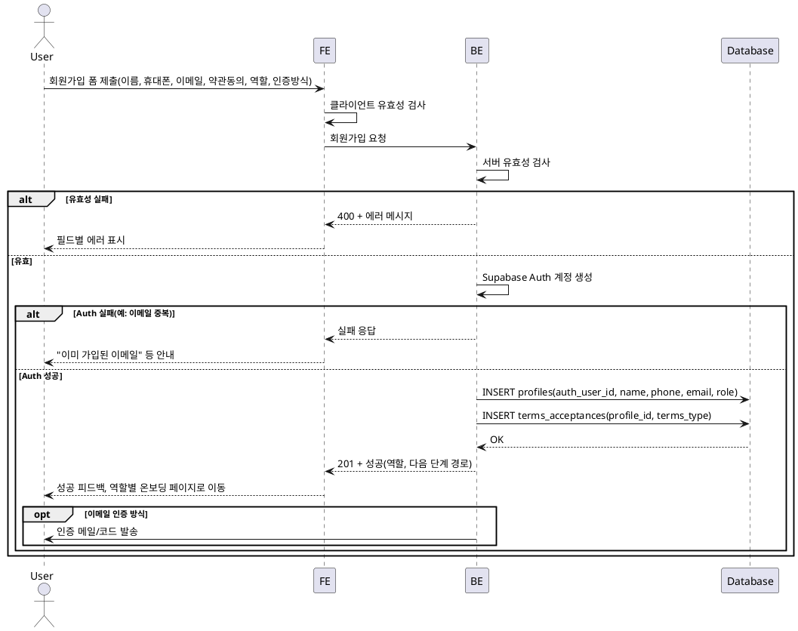

# 001. 회원가입 & 역할선택 — 유스케이스 명세

userflow §1 대응. 검토용 최소 명세.

---

## Primary Actor

- **가입 희망자** (비로그인 사용자): 이름·연락처·이메일·약관동의·역할을 입력하고 계정을 생성하려는 주체.

---

## Precondition (사용자 관점)

- 사용자가 로그인되어 있지 않다.
- 회원가입(또는 가입 진입) 페이지에 접근할 수 있다.
- 역할(광고주/인플루언서)을 하나 선택할 수 있는 상태이다.

---

## Trigger

- 사용자가 회원가입 폼에 **이름, 휴대폰번호, 이메일, 약관동의, 역할, 인증 방식(이메일/외부)** 을 입력하고 제출한다.

---

## Main Scenario

1. 사용자가 회원가입 페이지에서 필수 항목을 입력하고 제출한다.
2. 시스템이 입력값을 유효성 검사한다(형식·필수값·약관 동의 여부).
3. 시스템이 Supabase Auth로 계정을 생성한다(이메일/비밀번호 또는 외부 OAuth).
4. 시스템이 `profiles`에 최소 레코드를 생성한다(auth_user_id, 이름, 휴대폰, 이메일, 역할).
5. 시스템이 동의한 약관에 대해 `terms_acceptances`에 이력을 저장한다.
6. 시스템이 성공 피드백을 보여주고, 이메일 인증 방식이면 인증 메일/코드를 발송한다.
7. 시스템이 선택된 역할에 따라 다음 단계로 분기한다.
   - **광고주** → 광고주 정보 등록(업체명, 위치, 카테고리, 사업자등록번호) 페이지로 이동.
   - **인플루언서** → 인플루언서 정보 등록(생년월일, SNS 채널) 페이지로 이동.

---

## Edge Cases

| 상황 | 처리 |
|------|------|
| 필수값 누락·형식 오류 | 유효성 검사 실패 시 해당 필드 에러 메시지 표시, 제출 차단. |
| 이메일 중복 | Auth/DB 중복 시 "이미 가입된 이메일" 안내, 재입력 유도. |
| 약관 미동의 | 필수 약관 미체크 시 제출 불가, 동의 요청 메시지 표시. |
| 레이트 리밋 초과 | 짧은 시간 내 반복 가입 시도 시 일시 차단 또는 캡차 등으로 제한. |
| 봇/비정상 요청 | 레이트 리밋·캡차·추가 검증으로 차단. |
| Auth/외부 연동 실패 | "일시적 오류" 안내, 재시도 유도; 필요 시 로그 수집. |
| DB 저장 실패(프로필/약관) | 사용자에게 오류 안내, 재시도 또는 고객센터 안내. |

---

## Business Rules

- **역할**: 한 계정당 하나의 역할만 선택 가능(광고주 또는 인플루언서).
- **약관**: 서비스 이용약관·개인정보처리방침 등 필수 약관에 동의해야 가입 가능.
- **이메일**: 가입 시 사용하는 이메일은 Auth 기준 유일; 중복 가입 불가.
- **인증 방식**: 이메일/비밀번호 또는 외부(OAuth) 중 하나로 계정 생성; 이메일 방식 시 검증 플로우 제공 가능.
- **프로필**: Auth 계정 생성 성공 후 반드시 `profiles` 1건 생성 및 `terms_acceptances`에 동의 이력 저장.

---

## Sequence Diagram (PlantUML)

---

*참조: docs/userflow.md §1, docs/PRD.md §3 회원가입 & 온보딩*
